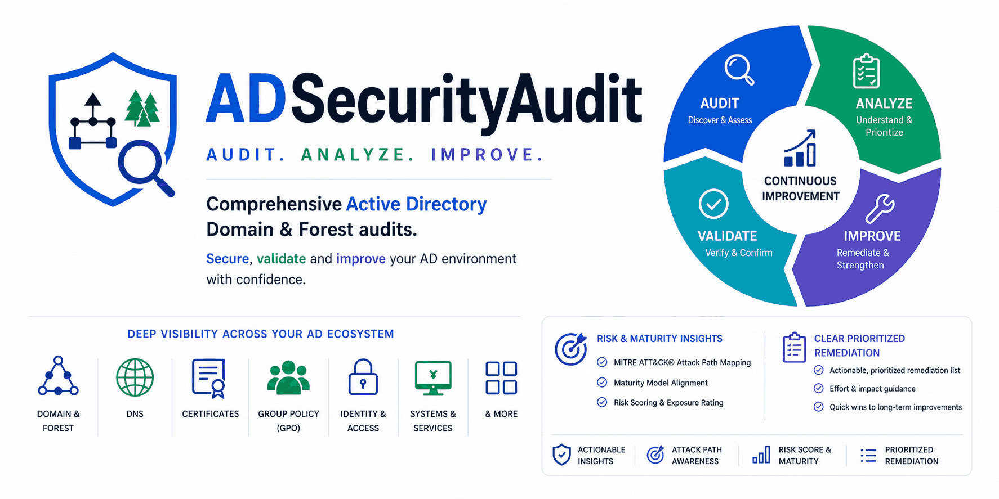

# Active Directory Security Audit

<p align="center">
  
</p>

A PowerShell module that finds misconfigurations and security vulnerabilities in Active Directory environments, plus a web dashboard (`ui/`) for browsing the results.

> **Independence note:** This is an independent, MIT-licensed project. Mentions of "PingCastle-comparable" describe which known AD concept a check maps to — not affiliation. Not produced by, affiliated with, or endorsed by Netwrix/PingCastle.

## Contents

- [Features](#features)
- [Requirements](#requirements)
- [Installation](#installation)
- [Usage](#usage)
- [Scoring & Maturity](#scoring--maturity)
- [Test Coverage](#test-coverage)
- [Offline / Snapshot Mode](#offline--snapshot-mode)
- [Multi-Domain / Forest Targeting](#multi-domain--forest-targeting)
- [Forest Consolidation, Retesting & Trends](#forest-consolidation-retesting--trends)
- [Exception / Remediation-State Tracking](#exception--remediation-state-tracking)
- [Findings by Severity](#findings-by-severity)
- [Report Interpretation](#report-interpretation)
- [Troubleshooting](#troubleshooting)
- [Security Best Practices](#security-best-practices)
- [Automation & Integration](#automation--integration)
- [Contributing / License / Disclaimer](#contributing--license--disclaimer)
- [Version History](#version-history)
- [Acknowledgments](#acknowledgments)

## Features

### Core checks
User account risks (AS-REP Roasting, weak/reversible encryption, unconstrained delegation, Kerberoasting, inactive accounts) · privileged group hygiene (excessive/nested membership, disabled users) · AdminSDHolder tampering · GPO misconfigurations (over-permissioned, insecure SYSVOL, mislinked) · DCSync detection · domain security settings (password policy, domain/forest functional level, tombstone lifetime, legacy systems) · dangerous ACL permissions on AD objects (critical OUs, Schema/Configuration naming context head objects).

<details>
<summary><strong>Advanced checks (click to expand — 20+ modules)</strong></summary>

- **AD CS (Certificate Services)**: ESC1/ESC2/ESC3/ESC7, plus **Extended**: ESC4 (weak template ACLs), ESC8 (HTTP enrollment without EPA), ROCA-vulnerable keys (CVE-2017-15361), weak signature/RSA sizes across CA + NTAuth/AIA/Root store, and CA chase-fallback exposure (CVE-2026-54121 "Certighost").
- **KRBTGT password age**: flags rotation older than the 180-day recommendation (Golden Ticket risk).
- **Domain trusts**: SID filtering, selective auth, direction, bidirectional exposure.
- **LAPS**: schema presence, coverage %, static local-admin passwords.
- **Audit policy**: critical policies enabled, SACLs on sensitive objects.
- **Delegation**: constrained delegation, protocol transition (T2A4D), resource-based constrained delegation (RBCD).
- **Risk Scoring / ANSSI Maturity / MITRE ATT&CK**: rolls findings into a 0–100 score with per-category sub-scores, a 1–5 ANSSI maturity level, and MITRE technique tags — all from one mapping table (`Get-ADRiskScore`, `Set-ADFindingMetadata`).
- **Snapshot & offline mode**: `Get-ADSnapshot` collects once; `Start-ADSecurityAudit -FromSnapshot` re-runs fully offline.
- **Machine Account Quota**: flags the unmodified default of 10 (or any non-zero value) — a common RBCD/SamAccountName-spoofing foothold.
- **Domain hardening flags**: dangerous `dSHeuristics` settings, broad membership in Pre-Windows 2000 Compatible Access, anonymous LDAP bind, and null-session pipe/share access (`RestrictNullSessAccess`).
- **Coercion & NTLM relay exposure**: Print Spooler / WebClient running on DCs, LDAP signing/channel binding not enforced.
- **AD-integrated DNS**: DnsAdmins membership (DC code-exec path), zone-transfer exposure, insecure dynamic updates, broad CreateChild rights (ADIDNS spoofing), and stale/dangling zone delegations (subdomain-takeover risk).
- **Legacy auth & name-poisoning surface**: SMBv1, SMB signing, LM/NTLMv1, LLMNR, WSUS-over-HTTP — distinguishing policy-enforced values from unset ones.
- **Kerberos hardening depth**: RC4 still permitted for Tier-0/krbtgt, trusts missing AES-only, Kerberos Armoring (FAST), cross-trust TGT delegation.
- **Stale-object & hygiene depth**: PASSWD_NOTREQD accounts, non-default `primaryGroupID` (membership-hiding technique), duplicate SPNs, DCs missing from AD Sites subnets, insufficient DC count.
- **GPO-deployed secrets**: leftover GPP `cpassword` (MS14-025), credential patterns in deployed scripts, insecure GPO settings (firewall, RDP NLA), and User Rights Assignments handing sensitive logon rights to broad principals.
- **Known DC vulnerabilities by patch/build**: ZeroLogon, EternalBlue, MS14-068, PrintNightmare, CVE-2026-41089 (Netlogon RCE), and BadSuccessor/dMSA exposure on Server 2025 DCs (per-DC CVE-2025-53779 patch classification) — all inferred from build/hotfix level, never exploitation.
- **Exchange-in-AD privilege escalation**: Exchange security principals holding dangerous rights on the domain object or AdminSDHolder — fires even on residual ACEs after Exchange is decommissioned.
- **RODC security posture**: cached/revealable Tier-0 secrets, overly broad replication policy, orphaned RODC krbtgt accounts.
- **Attack-path graph**: builds a control-edge graph (dangerous ACEs, group membership, ownership) and computes reachability from any non-Tier-0 principal to Tier-0 targets, with full hop chains and an optional BloodHound-compatible export.
- **Multi-domain/forest consolidation**: rolls up prior per-domain JSON exports into one forest score, heatmap, and comparison table — a free equivalent to PingCastle's paid "Conso" feature.

</details>

## Requirements

- Windows PowerShell 5.1 or PowerShell 7+
- Active Directory + Group Policy PowerShell modules (RSAT)
- Domain Admin (or equivalent) for a full audit
- Windows Server 2016+ recommended, network access to DCs
- Read access to AD CS if installed

## Installation

```powershell
Get-WindowsCapability -Name RSAT.ActiveDirectory* -Online | Add-WindowsCapability -Online
Get-WindowsCapability -Name Rsat.GroupPolicy.Management.Tools* -Online | Add-WindowsCapability -Online
```

<details open>
<summary><strong>Option A — Run in place (recommended)</strong></summary>

```powershell
git clone https://github.com/sean-aura/ADSecurityAudit.git
cd ADSecurityAudit
Import-Module .\ADSecurityAudit.psd1
```

To update:
```powershell
git pull
Import-Module .\ADSecurityAudit.psd1 -Force
```
If you didn't clone via git, just re-download over the same folder and re-run `Import-Module -Force`.

</details>

<details>
<summary><strong>Option B — Install into a PowerShell modules directory</strong></summary>

```powershell
$modulePath = "$env:ProgramFiles\WindowsPowerShell\Modules\ADSecurityAudit"
New-Item -Path $modulePath -ItemType Directory -Force
Copy-Item -Path ".\ADSecurityAudit.psd1" -Destination "$modulePath\ADSecurityAudit.psd1"
Copy-Item -Path ".\ADSecurityAudit.psm1" -Destination "$modulePath\ADSecurityAudit.psm1"
Copy-Item -Path ".\src" -Destination "$modulePath\src" -Recurse -Force
Import-Module ADSecurityAudit
```

**To update:** close any session with the module loaded (or `Remove-Module ADSecurityAudit -Force`), re-copy the files above with `-Force`, then start a new session and confirm with `(Get-Module ADSecurityAudit).Version`.

</details>

## Usage

**Basic audit:**
```powershell
Start-ADSecurityAudit -ExportPath "C:\ADReports"
```

**Verbose:**
```powershell
Start-ADSecurityAudit -ExportPath "C:\ADReports" -Verbose
```

**Targeting another domain/DC** (multi-domain forests): by default the audit targets your own account's domain — no parameter needed. Pass `-Server` only when auditing a *different* domain, or when only one DC is reachable:
```powershell
Start-ADSecurityAudit -Server domainb.corp.com -ExportPath "C:\ADReports"
# or target one specific DC directly:
Start-ADSecurityAudit -Server dc01.domainb.corp.com -ExportPath "C:\ADReports"
```
Every standalone audit function accepts the same `-Server` parameter. Full detail (PDC Emulator resolution, `runas /netonly` limitation, internals): see [Multi-Domain / Forest Targeting](#multi-domain--forest-targeting).

**Offline / snapshot:**
```powershell
Get-ADSnapshot -ToJson "C:\Snapshots\contoso.json"
Start-ADSecurityAudit -FromSnapshot "C:\Snapshots\contoso.json" -ExportPath "C:\ADReports"
```

**Output formats:** HTML (interactive, risk gauge, maturity panel, MITRE summary, Test Coverage section) · CSV (with `MitreTechnique`/`AnssiControl`/`Weight`/`TestName` columns) · JSON · a JSON score sidecar (`AD_Security_Score_<timestamp>.json`) · a test coverage sidecar (`AD_Security_TestCoverage_<timestamp>.json`/`.csv`) recording, for every registered check, whether it ran clean, ran and found something, failed, or was excluded.

**Visual dashboard:** open `ui/index.html`, upload a generated JSON report (or click **Load sample report**) to browse findings by severity with remediation links.

## Scoring & Maturity

Every run produces an executive roll-up via `Get-ADRiskScore`:

- **Risk score (0–100, higher = worse)** — diminishing returns per category; the global score is the *worst* category's score (similar philosophy to PingCastle's "as exposed as your weakest area," own math).
- **Per-category sub-scores** — rendered as bars in the HTML report.
- **ANSSI-style maturity (1–5, higher = better)** — a single Level-1 finding caps maturity at Level 1.
- **MITRE ATT&CK tagging** — every finding maps to a technique (e.g. `T1558.001` Golden Ticket), with a frequency summary in the report.

All three come from one mapping table in `src/Scoring.ps1` (`Issue → MITRE technique → ANSSI control → weight`) — extend coverage by adding one entry there. The output schema is additive-only.

## Test Coverage

Since v1.24.0, every run records not just what it *found*, but what it *checked*: for every registered check (`-IncludeTests`/`-ExcludeTests` in mind), the report shows whether it ran clean, ran and found something, failed, or was deliberately excluded. Previously a check that errored out only produced a console warning, and a check that ran and found nothing was indistinguishable from one that never ran at all — a "clean" report and an "incomplete" report looked identical.

- **HTML** — a "Test Coverage" section (collapsed by default; click to expand the full per-check list — it's a large table when every check is listed) with a per-check badge (`COMPLETED` / `CLEAN` / `FAILED` / `EXCLUDED`) and a summary line, visible either way, breaking out passed-clean vs. found-issues vs. untested (failed+excluded) as distinct counts.
- **CSV/JSON sidecars** — `AD_Security_TestCoverage_<timestamp>.json`/`.csv`, alongside the existing findings/score exports.
- **A fully clean run (zero findings) now exports a full report** — previously this was silently skipped, since export was gated on having at least one finding.
- **`Export-ADSecurityReportCSVFromJson`** (new) — the CSV equivalent of `Export-ADSecurityReportHTMLFromJson`, rebuilding the findings CSV (and coverage CSV, if available) from an old JSON export offline.
- An export that predates test coverage tracking gets an explicit note rather than a silently-missing section: the HTML rebuild path adds a "Test Coverage Not Available" note citing the version boundary, and the CSV rebuild path still writes a coverage CSV with a single explanatory row instead of omitting the file.
- **Forest Consolidation, Retest Comparison, and Maturity Trend all cross-check against this data too** — see [Forest Consolidation, Retesting & Trends](#forest-consolidation-retesting--trends) for why this matters (a false "Resolved" claim, or a misleading score/domain comparison, can both result from under-testing rather than genuine improvement if this isn't accounted for).

## Offline / Snapshot Mode

Since v1.3.0, collection is decoupled from rule evaluation:

- **`Get-ADSnapshot [-ToJson <path>]`** — one read-only pass over users, computers, groups, GPOs, key ACLs, AD CS config, DNS zones, trusts, DC inventory, and machine account quota.
- **`Start-ADSecurityAudit -FromSnapshot <path>`** — re-runs the full audit offline, no live AD access, same report outputs as a live run.
- **`Get-ADTier0Principal [-Snapshot $snapshot]`** — shared privileged/Tier-0 principal set, usable live or offline.

```powershell
Get-ADSnapshot -ToJson "C:\Snapshots\contoso_2026-07-07.json" -Verbose
Start-ADSecurityAudit -FromSnapshot "C:\Snapshots\contoso_2026-07-07.json" -ExportPath "C:\ADReports"
```

<details>
<summary><strong>Which of the 28 tests are fully vs. partially offline-capable (click to expand)</strong></summary>

As of v1.19.0 all 27 registered tests (28 as of v1.23.6, with the addition of `Test-ADCSChaseFallback`) support `-Snapshot`, fully or partially. As of v1.19.1, `-Snapshot` means literally zero live AD/network access — every skipped sub-check records a structured note, visible in the HTML report's **"Offline Mode Coverage Notes"** table.

- **Fully offline-capable:** `Test-ADUserSecurity`, `Test-KRBTGTAccount`, `Test-ADMachineAccountQuota`, `Test-ADExchangeEscalation`, `Test-ADPrivilegedGroups`, `Test-AdminSDHolder`, `Test-ADReplicationSecurity`, `Test-ADDangerousPermissions`, `Test-LAPSDeployment`, `Test-ConstrainedDelegation`, `Test-ADDomainTrusts`, `Test-ADDomainSecurity`, `Test-ADCertificateServices`, `Test-ADDomainAdminEquivalence`.
- **Partially offline** (a few sub-checks are genuinely real-time and get skipped under `-Snapshot`, with a logged reason each time):
  - `Test-ADDomainHardeningFlags` — dSHeuristics/Pre-2000 membership offline; anonymous-bind probe is live-only.
  - `Test-ADCoercionAndRelayExposure` — only the DC list comes from the snapshot; Spooler/WebClient/LDAP registry checks are live-only.
  - `Test-ADCSExtended` — template/CA enumeration, ESC4, approval-gate, and NTAuth/AIA/Root sweep are offline; only ESC8 (a live HTTP probe) is live-only.
  - `Test-ADCSChaseFallback` — live-only (reads `policy\EditFlags` on the CA host itself, no snapshot representation), same as ESC8.
  - `Test-ADDnsSecurity` — DnsAdmins membership is offline; zone transfer, dynamic-update, ADIDNS, and delegation-staleness checks are live-only (not in current snapshot schema).
  - `Test-ADKerberosHardening` — account/trust-level RC4 checks are offline; domain-wide encryption policy and FAST are live-only.
  - `Test-ADStaleObjectDepth` — PASSWD_NOTREQD/primaryGroupID/duplicate-SPN/DC-count are offline; DC subnet/site registration is live-only.
  - `Test-ADRodcSecurity` — entirely skipped under `-Snapshot` (every finding needs live per-RODC attributes).
  - `Test-ADGroupPolicies` — over-permissioned/unlinked GPO checks offline; SYSVOL file-share ACL check is live-only.
  - `Test-AuditPolicyConfiguration` — SACL-presence checks offline; per-DC `auditpol` is live-only.
  - `Test-ADControlPaths` — membership/DC/AdminSDHolder edges offline; ACL/ownership edges for other objects in a chain aren't (recorded as a coverage note, not a live read).
  - `Test-ADGpoDeployedSecrets` — entirely skipped under `-Snapshot` (its whole job is scanning SYSVOL file content).
- **Declared but effectively live-only** (no findings under `-Snapshot`): `Test-ADLegacyAuthSurface`, `Test-ADKnownDCVulnerabilities`.

</details>

## Multi-Domain / Forest Targeting

In a multi-domain forest, an AD query without an explicit `-Server` resolves against the *auditor's own logon domain*, not necessarily the domain you mean to audit — this can silently scope results to the wrong domain (most visibly `Test-ADMachineAccountQuota`).

**Default:** if `-Server` is omitted, it now defaults to your own domain (`$env:USERDNSDOMAIN`) — no parameter needed for the common case. Whatever `-Server` resolves to is then further resolved to that domain's **PDC Emulator**, so every query in the run hits the same, well-defined DC (visible in `-Verbose` as `resolved '...' to its PDC Emulator '...'`).

```powershell
Start-ADSecurityAudit -Server domainb.corp.com -ExportPath "C:\ADReports"
# or target one specific DC directly (honored exactly as given):
Start-ADSecurityAudit -Server dc01.domainb.corp.com -ExportPath "C:\ADReports"
```

Also available standalone: `Test-ADMachineAccountQuota -Server ...`, `Get-ADSnapshot -Server ...`, `Test-ADUserSecurity -Server ...`, `Get-ADPrivilegedUsers -Server ...`, `Test-ADPrivilegedGroups -Server ...`, `Test-ADDomainAdminEquivalence -Server ...`, `Test-ADRodcSecurity -Server ...`. Ignored (with a warning) alongside `-FromSnapshot`, since offline mode makes no live queries at all.

**Known limitation:** `runas /netonly` doesn't change `$env:USERDNSDOMAIN` — pass `-Server` explicitly in that case.

<details>
<summary><strong>What the -Server fix actually touches under the hood (click to expand)</strong></summary>

This override applies everywhere the module talks to AD, including several paths that don't go through normal `Get-AD*` cmdlets and would otherwise silently ignore it or query the wrong scope:

- **GroupPolicy module** (`Get-GPO`, `Get-GPInheritance`, `Get-GPPermission`, `Get-GPRegistryValue`) is a separate PowerShell module — the `Get-AD*` wildcard never covered it, so GPO-derived findings were previously unscoped by `-Server`. Fixed by installing the equivalent `Get-GP*`/`Set-GP*` wildcards.
- **Certificate template/CA ACL reads** used `Get-Acl -Path "AD:$dn"`, which has no `-Server` parameter — now uses `Get-ADObject -Properties nTSecurityDescriptor` instead, same as `Test-AdminSDHolder`.
- **SYSVOL UNC paths** were built from the bare domain name, resolving via DFS referral based on the *calling machine's* site — now built with the resolved `-Server` directly in the path.
- **Raw ADSI RootDSE binds** (`[ADSI]"LDAP://RootDSE"`) are invisible to the override — now go through `Get-ADRootDSE`.
- **Live-probe checks** calling `Get-ADDomainController -Discover` directly threw and silently skipped under an active override — now resolve against the override directly.
- **Enterprise/Schema Admins checks** only exist in the forest root — now re-queries the forest root when a child-domain-scoped lookup comes back empty.
- **Per-DC enumeration** used a bare `Get-ADDomainController -Filter *`, which queries the *forest-wide* Sites container regardless of `-Server` — the actual root cause of most "wrong domain" reports. Fixed via a new `Get-ADSecurityAuditDomainController` helper that filters to DCs whose `.Domain` matches the resolved target.

**Since corrected further:** a specific DC passed to `-Server` is now honored exactly as given (never silently promoted to the PDC Emulator), and per-DC probes scope to only that named DC.

</details>

## Forest Consolidation, Retesting & Trends

Three offline, file-based post-processing features — none perform additional AD queries, and none are part of the live audit test set.

<details>
<summary><strong>Forest Consolidation — Get-ADForestConsolidation (since v1.17.0)</strong></summary>

Rolls up two or more prior per-domain JSON exports into one forest-wide view:

- **Forest score rollup** — worst-domain (MAX) semantics, same as per-domain scoring.
- **Per-category heatmap** — worst per-domain score per category.
- **Domain comparison table** — finding counts by severity, worst-first, plus a **Coverage column** (since v1.24.0) flagging any domain with untested (failed/excluded) checks or no coverage data at all — a domain that looks "cleaner" purely from checking less is called out rather than mistaken for genuinely better posture.
- **Cross-domain trust-risk enrichment** — annotates trust findings with the target domain's own score, when scanned.
- **Newly-missing domains** — via `-PriorConsolidationPath`, flags domains scanned before but absent this run.

```powershell
Get-ADForestConsolidation -ReportPath "C:\Reports" -Verbose |
    Export-ADForestConsolidationHTML -OutputPath "C:\Reports\forest-report.html"
```

Comparable in spirit to PingCastle's paid "Conso" report — implemented independently against this project's own schema.

</details>

<details>
<summary><strong>Retest Comparison — Get-ADRetestComparison (since v1.21.0)</strong></summary>

Compares a pre-remediation baseline against a post-remediation retest of the same domain:

- **Score & maturity delta** — both runs recomputed under the *current* scoring table, so version drift doesn't distort the delta.
- **Per-category delta**.
- **New / Resolved / Unconfirmed / Still Open / Changed findings** — matched by Category+Issue+AffectedObject (not just Category+Issue, so partial remediation shows correctly). Since v1.24.0, a finding that disappears from the retest is only counted as **Resolved** if the check that would have found it is confirmed to have actually run; if that check failed or was excluded in the retest, the finding lands in a separate **Unconfirmed** bucket instead — its disappearance is not evidence of remediation, just of not being re-checked.
- **`Export-ADRetestComparisonHTML`** — togglable Current State / Delta View, plus an Unconfirmed section and Coverage Caveats box when relevant.

```powershell
Get-ADRetestComparison -BaselinePath "C:\Reports\Pre" -RetestPath "C:\Reports\Post" -Verbose |
    Export-ADRetestComparisonHTML -OutputPath "C:\Reports\retest-report.html"
```

`-BaselinePath`/`-RetestPath` accept a file or a folder (newest export used).

</details>

<details>
<summary><strong>Maturity Trend History — Get-ADMaturityTrend (since v1.22.0)</strong></summary>

Answers "what's the trajectory over N runs" rather than a two-point comparison:

- **Score/maturity over time** — chronological series from every score sidecar under `-ReportPath`.
- **Per-category trend** — Improving / Flat / Regressing per category.
- **`Export-ADMaturityTrendHTML`** — inline-SVG line chart, per-category sparklines, and a table showing module version per run (so a score jump can be attributed to a tool change vs. real posture change), plus a **Coverage column** (since v1.24.0) flagging any run with untested (failed/excluded) checks or no coverage data at all — a score that looks like improvement purely from checking less is called out rather than read as genuine progress.

Unlike Retest Comparison, this does **not** recompute scores under the current table — it shows the historical record exactly as originally scored.

```powershell
Get-ADMaturityTrend -ReportPath "C:\Reports\contoso.com" -Verbose |
    Export-ADMaturityTrendHTML -OutputPath "C:\Reports\maturity-trend.html"
```

With only one sidecar, no trend is computed (`RunCount = 1`, explanatory message, no error).

</details>

<details>
<summary><strong>Recreating HTML/CSV reports from JSON, with no re-scan</strong></summary>

- **`Export-ADSecurityReportHTMLFromJson`** — rebuilds the main audit HTML report from an `AD_Security_Audit_<timestamp>.json` export alone. Score/maturity/MITRE are recomputed fresh. Gaps it *can't* recover (never stored in that JSON): Domain, Duration, RunMode, Offline Mode Coverage Notes, and the Privileged Users section — pass what you know via parameters, or accept the placeholders. Findings missing supporting information (`EstimatedEffort`/`KnownRisks`/`BackupRollback`/`OperationalNotes`, or MITRE/ANSSI/Weight metadata) because the export predates those fields are backfilled with current guidance where available (`Merge-ADFindingNarrativeGaps`), clearly labeled as such — never silently presented as if it were part of the original run.
- **`Export-ADSecurityReportCSVFromJson`** (new in v1.24.0) — the CSV equivalent: rebuilds the findings CSV (and, if the sidecar exists, a coverage CSV) from the same JSON export, using the exact same column-construction function as the live export so the two can't drift apart.
- Both rebuild functions accept a folder for `-OutputPath` (not just an exact file path) - an auto-named `AD_Security_Audit_<timestamp>-recreated.<ext>` is created inside it, so pointing this at "the reports folder" just works without constructing a filename yourself, and without risk of overwriting the original same-timestamp report.
- Both rebuild paths pick up a sibling `AD_Security_TestCoverage_<timestamp>.json`, if present, to populate the Test Coverage section/CSV; an export that predates coverage tracking gets an explicit note instead of a silently-missing section.
- **Retest comparison JSON** round-trips the same way: reload with `ConvertFrom-Json` and pipe straight into `Export-ADRetestComparisonHTML` — no need to re-run the comparison. The same idiom works for Forest Consolidation and Maturity Trend.

```powershell
# HTML - explicit findings file, explicit output file:
Export-ADSecurityReportHTMLFromJson -FindingsPath "C:\Reports\AD_Security_Audit_2026-08-01_00-00-00.json" `
    -OutputPath "C:\Reports\AD_Security_Audit_2026-08-01_00-00-00-recreated.html" `
    -Domain "contoso.com"

# HTML - folder form for both: picks the newest AD_Security_Audit_*.json in
# the folder, and auto-names the output file inside that same folder
# (never overwrites the original same-timestamp report):
Export-ADSecurityReportHTMLFromJson -FindingsPath "C:\Reports" -OutputPath "C:\Reports"

# CSV - same two forms, same auto-naming convention. Also writes a
# "-coverage.csv" alongside it automatically if a coverage sidecar exists:
Export-ADSecurityReportCSVFromJson -FindingsPath "C:\Reports\AD_Security_Audit_2026-08-01_00-00-00.json" `
    -OutputPath "C:\Reports\AD_Security_Audit_2026-08-01_00-00-00-recreated.csv"

Export-ADSecurityReportCSVFromJson -FindingsPath "C:\Reports" -OutputPath "C:\Reports"
```

</details>

## Exception / Remediation-State Tracking

Since v1.23.0, a small file-based store lets you record "we've accepted this risk" so a persisting finding doesn't look identical to a neglected one on retest. Purely additive — never inferred automatically, and doesn't change scoring.

- **`Set-ADRemediationState -Key <k> -Status <Open|AcceptedRisk|InProgress|Remediated> [-Owner] [-Note] -StatePath <path>`**
- **`Get-ADRemediationState -StatePath <path>`**
- **`Get-ADRetestComparison -RemediationStatePath <path>`** — annotates Still Open / Changed findings with the tracked state.
- **`Export-ADRetestComparisonHTML`** — badges each Still Open finding by status.

```powershell
$key = Get-ADFindingMatchKey -Category 'Certificate Services' `
    -Issue 'Enrollment Agent Template with Low-Privilege Enrollment (ESC3)' `
    -AffectedObject 'CN=LegacyEnroll,CN=Certificate Templates,...'

Set-ADRemediationState -Key $key -Status AcceptedRisk -Owner 'jane.doe@contoso.com' `
    -Note 'Legacy app dependency, tracked in JIRA-1234, revisit Q3 2027.' `
    -StatePath 'C:\Reports\AD_Remediation_State.json'
```

An `AcceptedRisk` finding still counts toward the risk score — this is a reporting annotation, not a scoring exclusion.

## Findings by Severity

<details>
<summary><strong>Critical</strong></summary>

- Exploitable AD CS certificate templates
- CA web enrollment reachable over HTTP without EPA (ESC8)
- CA chase-fallback enabled (CVE-2026-54121 "Certighost" exposure)
- Non-standard permissions on the Schema or Configuration naming context head object
- KRBTGT password not rotated (Golden Ticket risk)
- Unconstrained delegation on user accounts
- DCSync permissions granted to non-admin users
- Domain trusts without SID filtering

</details>

<details>
<summary><strong>High</strong></summary>

- Weak password policies; accounts with password never expires
- Service accounts with SPNs using weak encryption
- Missing LAPS deployment on computers
- Disabled critical audit policies
- Constrained delegation with protocol transition
- Machine Account Quota left at the unrestricted default of 10
- Dangerous `dsHeuristics` flags; broad membership in Pre-Windows 2000 Compatible Access
- Certificate templates with weak ACLs (ESC4) or missing manager approval
- ROCA-vulnerable (CVE-2017-15361) certificate keys
- Non-default DnsAdmins membership; AD-integrated DNS zones with broad CreateChild rights (ADIDNS spoofing)
- SMBv1 enabled/not disabled by policy; SMB signing not required
- LM/NTLMv1 permitted (`LmCompatibilityLevel` < 3); WSUS delivered over HTTP

</details>

<details>
<summary><strong>Medium</strong></summary>

- Nested groups in privileged groups; stale privileged accounts
- Missing selective authentication on trusts
- Low LAPS coverage percentage
- Resource-based constrained delegation configurations
- Non-zero (but reduced) Machine Account Quota
- Anonymous LDAP/RootDSE binding; null-session pipe/share access permitted
- Weak signature algorithms or undersized RSA keys in the PKI trust store
- AD-integrated DNS zones allowing broad transfer or insecure dynamic updates
- LLMNR not disabled by policy
- Outdated forest functional level

</details>

<details>
<summary><strong>Low</strong></summary>

- Informational findings about domain configuration
- Baseline security posture indicators
- Forest tombstone lifetime below 180 days

</details>

## Report Interpretation

**HTML report structure:** Executive Summary (clickable severity cards) → Risk Score & Maturity (gauge, ANSSI ladder, category bars, MITRE summary) → Critical Issues → Detailed Findings (collapsed by default, one entry per Category+Issue with every affected object listed underneath) → Affected Objects. When applicable, a **Run Scope Information** box appears near the top (e.g. `-Server` named a specific DC that isn't the domain's PDC Emulator) alongside the offline-mode boxes for `-FromSnapshot` runs, and a **Test Coverage** box (collapsed by default, click to expand the full per-check list — see [Test Coverage](#test-coverage)) when coverage data is available for the run.

**Each finding includes:** Description, Impact, Affected Objects, and step-by-step Remediation.

<details>
<summary><strong>Full breakdown of checks by category (click to expand)</strong></summary>

**Certificate Services:** ESC1/ESC2/ESC3/ESC7/ESC4/ESC8, missing manager-approval gates, ROCA-vulnerable keys, weak signature/RSA sizes across CA + trust store, CA chase-fallback exposure (CVE-2026-54121 "Certighost").

**Kerberos Security:** KRBTGT age, unconstrained/constrained+protocol-transition delegation, RC4 encryption.

**Trust Relationships:** missing SID filtering, bidirectional trusts, missing selective auth, stale/misconfigured trusts.

**Local Administrator Security:** missing LAPS, static local admin passwords, missing schema extensions.

**Machine Account Quota:** unmodified default of 10; any non-zero value enabling self-service computer joins.

**Domain Hardening Flags:** dangerous `dSHeuristics`, broad Pre-2000 Compatible Access membership, anonymous LDAP bind, null-session pipe/share access.

**Coercion & NTLM Relay:** Print Spooler/WebClient running on a DC, LDAP signing/channel binding not enforced.

**AD-Integrated DNS:** non-default DnsAdmins members, open zone transfer, insecure dynamic updates, broad CreateChild rights, stale/dangling delegations (subdomain takeover).

**Legacy Auth & Name-Poisoning:** SMBv1, SMB signing, LM/NTLMv1, LLMNR, WSUS-over-HTTP.

**Kerberos Hardening Depth:** RC4 for Tier-0/krbtgt, trusts missing AES-only, domain-wide encryption policy, Kerberos Armoring (FAST), cross-trust TGT delegation.

**Stale-Object & Hygiene Depth:** PASSWD_NOTREQD accounts, non-default `primaryGroupID`, duplicate SPNs, DCs missing subnet coverage, DC count < 2.

**GPO-Deployed Secrets:** leftover GPP `cpassword`, credential patterns in deployed scripts, insecure GPO settings, User Rights Assignments granting sensitive logon rights to broad principals.

**Known DC Vulnerabilities:** ZeroLogon, EternalBlue, MS14-068, PrintNightmare, CVE-2026-41089, BadSuccessor/dMSA (per-DC CVE-2025-53779 classification) — all from build/hotfix level, never exploitation.

**Exchange-in-AD Escalation:** Exchange principals holding dangerous rights on the domain object or AdminSDHolder, including residual ACEs after decommission.

**RODC Security Posture:** cached/revealable Tier-0 secrets, overly broad replication policy, orphaned krbtgt accounts.

**Attack-Path Graph:** indirect control paths to Tier-0 objects via group membership/ACE/ownership chains; broad principals on any path are always Critical; non-Tier-0 ownership of a Tier-0 object; optional BloodHound export.

**Monitoring & Logging:** disabled audit policies, missing SACLs on AdminSDHolder, insufficient privilege-escalation logging.

</details>

## Troubleshooting

<details>
<summary><strong>Multi-domain data looks wrong</strong></summary>

If `-Server` is set but data still looks like it's coming from the wrong domain:

1. **Update first** — the `Get-ADDomainController -Filter *` and GroupPolicy-module gaps (see [Multi-Domain / Forest Targeting](#multi-domain--forest-targeting)) were the most common causes and are fixed in current versions.
2. **Confirm the override took effect** — run with `-Verbose` and check for `Server override: forcing all AD queries to target '<value>'`.
3. **Pass a specific DC FQDN**, not just the domain name — a bare domain name depends on DNS-based locator resolution, which can silently fall back to the wrong domain if conditional forwarders aren't configured.
4. **Confirm `-Server` is on the same invocation** producing the report — it doesn't persist across separate commands, and calling a `Test-AD*` function directly (outside `Start-ADSecurityAudit`) has no `-Server` of its own except `Test-ADMachineAccountQuota`/`Get-ADSnapshot`.
5. **Check "Cross-Domain Privileged Group Membership"** if the mismatch is in group members rather than DCs — nested/universal groups can legitimately span domains.
6. If using `runas /netonly`, pass `-Server` explicitly (see Known Limitation above).

</details>

**Module import failure:**
```powershell
Get-WindowsCapability -Name RSAT.ActiveDirectory* -Online | Add-WindowsCapability -Online
Get-WindowsCapability -Name Rsat.GroupPolicy.Management.Tools* -Online | Add-WindowsCapability -Online
```

**Permission denied:** run PowerShell as Administrator; verify Domain Admin (or equivalent); check DC connectivity.

**Certificate Services checks failing:** requires AD CS installed and CA query permissions — gracefully skips if not present. If you see `CA 'Enrollment Services' has no dNSHostName; skipping ESC8 probe`, that's a fixed bug (an old version matched the `CN=Enrollment Services` container itself, not your real CA) — your actual CA is unaffected; update to clear it.

**Incomplete LAPS results:** verify schema extensions, permission to read `ms-Mcs-AdmPwd`, and LAPS GPO deployment.

## Security Best Practices

1. Rotate KRBTGT password every 180 days (twice, 24 hours apart)
2. Deploy LAPS to 100% coverage
3. Review certificate templates — remove unnecessary ones, restrict enrollment
4. Enable advanced audit policies for AD object access
5. Harden trusts — SID filtering, selective authentication
6. Remove unconstrained delegation — migrate to constrained/RBCD
7. Implement a tiered access model, separating Tier-0 accounts
8. Run this audit monthly to track posture over time

## Automation & Integration

**Scheduled task:**
```powershell
$action = New-ScheduledTaskAction -Execute "PowerShell.exe" `
    -Argument "-NoProfile -ExecutionPolicy Bypass -Command `"Import-Module ADSecurityAudit; Start-ADSecurityAudit -OutputPath 'C:\ADReports'`""
$trigger = New-ScheduledTaskTrigger -Weekly -DaysOfWeek Monday -At 2am
Register-ScheduledTask -TaskName "AD Security Audit" -Action $action -Trigger $trigger -RunLevel Highest
```

**SIEM integration** (e.g. Splunk HEC):
```powershell
$findings = Get-Content "C:\ADReports\AD_Security_Findings_*.json" | ConvertFrom-Json
foreach ($finding in $findings) { Send-SplunkEvent -Finding $finding }
```

**Dashboard for JSON outputs:**
```bash
cd ui
python3 -m http.server 8000
```
Open `http://localhost:8000`, then upload a JSON file, paste JSON, load from a URL, or use the bundled sample.

## Contributing / License / Disclaimer

**Contributing:** contributions welcome.

**License:** MIT — use at your own risk, test in non-production first.

**Disclaimer:** this tool is read-only but requires elevated privileges. Always review the code before running in production, test in a lab first, confirm authorization, back up before remediating, and understand each remediation's impact.

## Version History

Full details in [CHANGELOG.md](./CHANGELOG.md). Recent highlights:

- **v1.24.0** — Added Test Coverage tracking: every report now shows which checks ran clean, found something, failed, or were excluded, instead of a clean run being indistinguishable from an incomplete one. New `Export-ADSecurityReportCSVFromJson` (CSV equivalent of the HTML JSON-rebuild path); both JSON-rebuild functions now accept a folder for `-OutputPath` and auto-name the file. Closed the same "under-testing looks like improvement" blind spot in `Get-ADRetestComparison` (a new `UnconfirmedFindings` bucket replaces false "Resolved" claims when the relevant check didn't actually run), `Get-ADMaturityTrend`, and `Get-ADForestConsolidation` (both flag incomplete/missing coverage rather than letting it silently skew a trend or cross-domain comparison). Fixed `-FromSnapshot` mode never tracking test coverage at all (it dispatches through a separate code path, `Invoke-ADRuleSet`, that Test Coverage tracking hadn't reached yet - every offline report rendered a nonsensical "0 check(s) tracked" box regardless of what actually ran). A full audit of the findings pipeline confirmed every check correctly populates the JSON/HTML/CSV outputs, with one latent gap fixed defensively: an unexpected `Severity` value (not currently produced by any check, but previously unhandled) would have been invisible in the HTML report - now rendered in a dedicated "Other / Unclassified Severity" section with a warning, so a finding can never silently disappear. Also fixed a scoring bug where a JSON-recreated finding missing MITRE/ANSSI/Weight metadata silently scored 0 instead of its real weight, two Kerberoasting findings having no supporting-information backfill at all due to a conditionally-named Issue the extraction tool didn't recognize, a general PowerShell null-vs-empty-array bug affecting several offline analysis functions, and both `Export-ADSecurityReportCSVFromJson` and `Export-ADSecurityReportHTML` itself having been defined but never actually exported by the module.
- **v1.23.9** — Added a "Run Scope Information" report section (and console notice) for whenever `-Server` names a specific DC that isn't the domain's actual PDC Emulator, so "PDC-only" checks (Machine Account Quota, domain security settings) don't silently query a different DC than a reader might assume.
- **v1.23.8** — Fixed "Insufficient Domain Controller Count" undercounting (and a related primaryGroupID false-positive) whenever `-Server` named one specific DC; both now use an always-unscoped DC inventory (`Get-ADSecurityAuditDomainController -IgnoreExplicitDCScope`) independent of per-DC-probe scoping. Also fixed `Get-ADTargetDomainController` to deterministically prefer the domain's PDC rather than an arbitrary enumerated DC.
- **v1.23.7** — Closed the four forest/forest-root coverage gaps: `Test-ADDomainSecurity` gained its own Outdated Forest Functional Level finding (previously only a `Details` sidecar under the domain-level check) and a Short Tombstone Lifetime check; `Test-ADDangerousPermissions` gained non-standard-permissions checks on the Schema and Configuration naming context head objects. All four are fully offline-capable.
- **v1.23.6** — Added `Test-ADCSChaseFallback`: detects CA chase-fallback exposure (CVE-2026-54121 "Certighost") by reading each Enterprise CA's `policy\EditFlags` for the `EDITF_ENABLECHASECLIENTDC` bit, which an unpatched CA uses to resolve certificate-request identity data from an attacker-controlled host — enabling DC impersonation. Flags Critical independent of patch level, since the flag itself is the exposure indicator.
- **Unreleased** — Fixed a multi-domain-forest bug: no query passed `-Server`, so results could silently resolve against the *auditor's* logon domain instead of the target. Added `-Server` to `Start-ADSecurityAudit`, `Get-ADSnapshot`, and `Test-ADMachineAccountQuota`, applied module-wide via a shared helper.
- **v1.20.5** — Added a null-session (unauthenticated pipe/share access) check to `Test-ADDomainHardeningFlags`, reusing the existing GPO-then-registry-fallback resolver.
- **v1.20.4** — Added a check for GPO-granted `SeNetworkLogonRight`/`SeRemoteInteractiveLogonRight` to broad principals (always Critical).
- **v1.20.0 – v1.20.3** — Dashboard/report visual overhaul: unified light theme, hand-built inline SVG visuals (risk gauge, category bars, control-path diagram), a Prioritized Remediation Order section, and several rendering bug fixes (modal display bug, oversized chart text, inconsistent monospace styling).
- **v1.19.0 – v1.19.1** — Full offline/`-Snapshot` parity across all 27 registered tests; hardened `-FromSnapshot` to mean literally zero live access, with explicit "Offline Mode Coverage Notes" in the report.
- **v1.18.0** — Added CVE-2026-41089 (Netlogon RCE) detection and per-DC CVE-2025-53779 (BadSuccessor/dMSA) patch classification.
- **v1.17.0** — Added `Get-ADForestConsolidation` — offline multi-domain rollup, a free equivalent to PingCastle's "Conso" report.
- **v1.16.0 – v1.16.2** — Added the attack-path graph (`Get-ADControlPathGraph`/`Test-ADControlPaths`); consolidated repeated per-object findings into single collapsible entries; rebalanced the risk-score model.
- **v1.0.0 – v1.15.0** — Built up from core AD hygiene checks to a full parity backlog: risk scoring, ANSSI maturity, MITRE tagging, snapshot mode, DNS security, Kerberos hardening, legacy-auth exposure, GPO-deployed secrets, known CVEs, Exchange escalation paths, and RODC posture.

See [CHANGELOG.md](./CHANGELOG.md) for the complete, version-by-version history.

## Support

Review the [Troubleshooting](#troubleshooting) section, check PowerShell event logs, confirm prerequisites are met, and re-run with `-Verbose` for detail.

## Acknowledgments

Built on industry-standard AD security assessment methodologies, inspired by Microsoft Security Best Practices, the MITRE ATT&CK Framework, Purple Knight, BloodHound's graph theory, and [PingCastle](https://github.com/netwrix/pingcastle) (Netwrix) — see the Independence note at the top of this README.

Thanks to Claude (Anthropic) for AI-assisted source analysis and implementation/bug-fix work across v1.2.0–v1.18.0, and to [denandz](https://github.com/denandz) for the patch that independently identified and fixed the `-Server` reliability issue.
